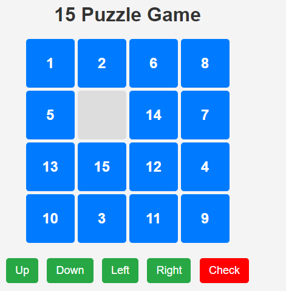
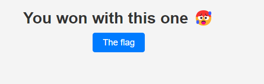

# 15 Puzzle

In this challenge, we were given a website that had a 15 puzzle game. You had to solve the puzzle in the least number of moves in order to proceed to the next round and get the flag. 



This script calculates the optimal solution, sends the array of moves to the server, and proceeds to the next puzzle until it receives a different link.

```python
import logging
import requests
from heapq import heappush, heappop
import time
import re
from urllib.parse import urljoin


logging.basicConfig(
    level=logging.INFO,
    format='%(asctime)s - %(levelname)s - %(message)s',
    handlers=[
        logging.FileHandler('puzzle_solver.log'),
        logging.StreamHandler()
    ]
)


BASE_URL = "http://chall.ehax.tech:8001/"
GOAL_STATE = [
    [1, 2, 3, 4],
    [5, 6, 7, 8],
    [9, 10, 11, 12],
    [13, 14, 15, 0]
]
TARGET_POS = {val: ((val-1)//4, (val-1)%4) for val in range(1, 16)}
TARGET_POS[0] = (3, 3) 

def fetch_puzzle_state(url):
    """Fetch and parse the initial puzzle state from a challenge URL"""
    try:
        logging.info(f"Fetching puzzle state from: {url}")
        response = requests.get(url, timeout=10)
        response.raise_for_status()
        
        match = re.search(r'let puzzle\s*=\s*(\[\[.*?\]\])', response.text, re.DOTALL)
        if not match:
            logging.error("Puzzle state not found in page HTML")
            return None
            

        puzzle_str = match.group(1)
        puzzle_str = re.sub(r'\s+', '', puzzle_str)  
        puzzle_str = re.sub(r',(\s*])', r'\1', puzzle_str)  
        
        logging.debug(f"Raw puzzle string: {puzzle_str}")
        initial_state = eval(puzzle_str)
        
        logging.info(f"Successfully parsed puzzle state from {url}")
        return initial_state
        
    except Exception as e:
        logging.error(f"Error fetching puzzle state: {str(e)}")
        return None

def enhanced_heuristic(state):
    """Optimized heuristic calculation with linear conflict detection"""
    distance = 0
    linear_conflicts = 0
    rows = [[] for _ in range(4)]
    cols = [[] for _ in range(4)]
    
    for i in range(4):
        for j in range(4):
            val = state[i][j]
            if val == 0:
                continue
                
            ti, tj = TARGET_POS[val]
            distance += abs(i - ti) + abs(j - tj)
            
            if ti == i:
                rows[i].append((j, val))
            if tj == j:
                cols[j].append((i, val))

    for row in rows:
        for j, (pos1, val1) in enumerate(row):
            for pos2, val2 in row[j+1:]:
                if val1 > val2:
                    linear_conflicts += 2

    for col in cols:
        for j, (pos1, val1) in enumerate(col):
            for pos2, val2 in col[j+1:]:
                if val1 > val2:
                    linear_conflicts += 2

    return distance + linear_conflicts

def solve_puzzle(initial_state):
    """A* solver with progress logging"""
    visited = set()
    heap = []
    start_time = time.time()
    
    initial_flat = tuple(sum(initial_state, []))
    goal_flat = tuple(sum(GOAL_STATE, []))
    
    heappush(heap, (enhanced_heuristic(initial_state), 0, initial_flat, []))
    visited.add(initial_flat)
    
    directions = [(-1, 0), (1, 0), (0, -1), (0, 1)]
    states_processed = 0
    last_log = time.time()

    try:
        while heap:
            priority, cost, current, path = heappop(heap)
            states_processed += 1
            

            if time.time() - last_log > 5:
                logging.info(
                    f"States processed: {states_processed} | "
                    f"Queue size: {len(heap)} | "
                    f"Current path length: {len(path)} | "
                    f"Elapsed: {time.time()-start_time:.2f}s"
                )
                last_log = time.time()
            
            if current == goal_flat:
                logging.info(f"Solved in {len(path)} moves (Time: {time.time()-start_time:.2f}s)")
                return path
            
            empty_idx = current.index(0)
            r, c = empty_idx // 4, empty_idx % 4
            
            for dr, dc in directions:
                nr, nc = r + dr, c + dc
                if 0 <= nr < 4 and 0 <= nc < 4:
                    new_idx = nr * 4 + nc
                    current_list = list(current)
                    current_list[empty_idx], current_list[new_idx] = current_list[new_idx], current_list[empty_idx]
                    new_state = tuple(current_list)
                    
                    if new_state not in visited:
                        new_cost = cost + 1
                        state_2d = [new_state[i*4:(i+1)*4] for i in range(4)]
                        priority = new_cost + enhanced_heuristic(state_2d)
                        heappush(heap, (priority, new_cost, new_state, path + [(dr, dc)]))
                        visited.add(new_state)
        
        return None
        
    except KeyboardInterrupt:
        logging.warning("Solver interrupted by user")
        return None

def submit_solution(current_url, moves):
    """Submit solution with detailed logging"""
    check_url = urljoin(current_url + "/", "check")  
    logging.info(f"Submitting to: {check_url}")
    
    try:
        logging.debug(f"Submission payload: {moves}")
        response = requests.post(
            check_url,
            json={"movements": moves},
            headers={"Content-Type": "application/json"},
            timeout=15
        )
        
        logging.info(f"Server response: {response.status_code}")
        logging.debug(f"Response headers: {response.headers}")
        logging.info(f"Response content: {response.text}")
        
        response.raise_for_status()
        json_response = response.json()
        logging.info("Submission successful")
        logging.debug(f"Full response: {json_response}")
        
        return json_response
        
    except requests.exceptions.RequestException as e:
        logging.error(f"Submission failed: {str(e)}")
        if hasattr(e, 'response') and e.response:
            logging.error(f"Error response: {e.response.text}")
        return None

def solve_challenge_chain(start_url):
    """Main loop to solve consecutive puzzles"""
    current_url = start_url
    level = 1
    
    while current_url:
        logging.info(f"\n{'='*40}")
        logging.info(f"Starting Level {level} - {current_url}")
        logging.info(f"{'='*40}")
        

        puzzle_state = fetch_puzzle_state(current_url)
        if not puzzle_state:
            break
            

        logging.info("Starting solver...")
        start_time = time.time()
        solution = solve_puzzle(puzzle_state)
        
        if not solution:
            logging.error("No solution found")
            break
            
        logging.info(f"Solution found in {time.time()-start_time:.2f} seconds")
        

        result = submit_solution(current_url, solution)
        if not result or not result.get('solved'):
            logging.error("Solution rejected by server")
            break
            

        next_path = result.get('next_puzzle')
        if not next_path:
            print(result)
            logging.info("Final puzzle solved!")
            break
            
        current_url = urljoin(BASE_URL, next_path)
        level += 1

if __name__ == "__main__":
    try:
        logging.info("Starting CTF Puzzle Challenge")
        initial_puzzle_url = urljoin(BASE_URL, "/p/d7b51dadf6594b0e8e0737a88ea176fd")
        solve_challenge_chain(initial_puzzle_url)
        logging.info("Challenge sequence completed")
    except Exception as e:
        logging.error(f"Critical error: {str(e)}", exc_info=True)
```

After 100 levels or so, we get this endpoint: `/fl4g_i5_you_c4n7_s33_m3`. Visiting this endpoint, we get a button labeled "The flag"



Clicking the button will take us to `/g37_y0ur_r3al_fl4g` with a GIF of a crying baby. I tried checking for steganography in the GIF but found nothing. After confirming with the author that there was no steganography, I looked at the response headers from the server when we visit the `/fl4g_i5_you_c4n7_s33_m3` endpoint and found Base64 encoded data in the `Hmm:` header.

```
Server: Werkzeug/3.1.3 Python/3.11.11
Date: Sun, 16 Feb 2025 03:29:39 GMT
Content-Type: text/html; charset=utf-8
Content-Length: 938
Hmm: RUg0WHtoNDk5eV91X3MwbHYzZF8xNV85dXp6MTNfMTAwXzdpbTM1fQ==
Connection: close
```

Decoding the Base64 encoded data gives us the flag.

### The Flag

The flag is:

```
EH4X{h499y_u_s0lv3d_15_9uzz13_100_7im35}
```